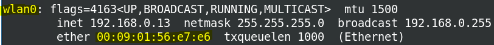
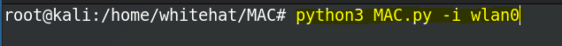
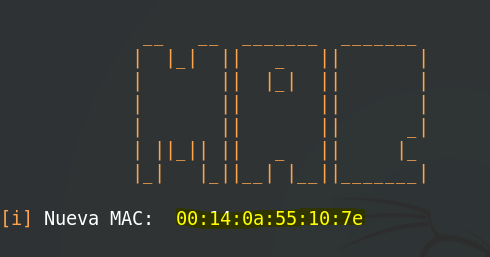
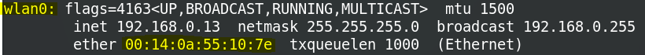

## MAC
MAC es un script que realiza el cambio de la direccion mac de interfaces de red.

### Ejecución
NOTA: Para su ejecución es necesario estar logueados como ROOT.

* Verificar la interfaz de red (En este caso es wlan0).

     

* Ejecucion del script

    

* Ejecución finalizada

     

* Resultado final

    

